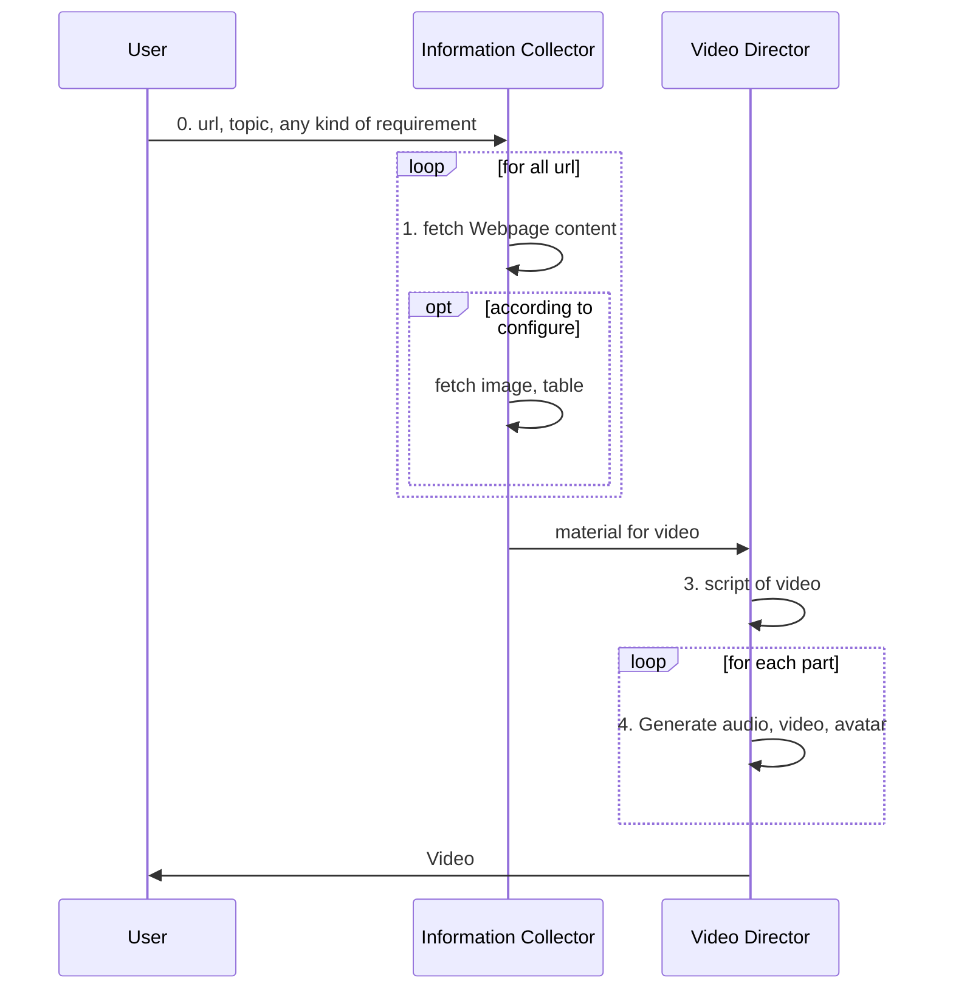

```mermaid
sequenceDiagram
    participant U as User
    participant I as Information Collector
    participant VD as Video Director

    U ->> I : 0. url, topic, any kind of requirement

    loop for all url
        I ->> I: 1. fetch Webpage content
        opt according to configure
            I ->> I: fetch image, table
        end
    end

    I ->> VD: material for video
    VD ->> VD: 3. script of video
    loop for each part
        VD ->> VD: 4. Generate audio, video, avatar
    end

    VD ->> U: Video
```